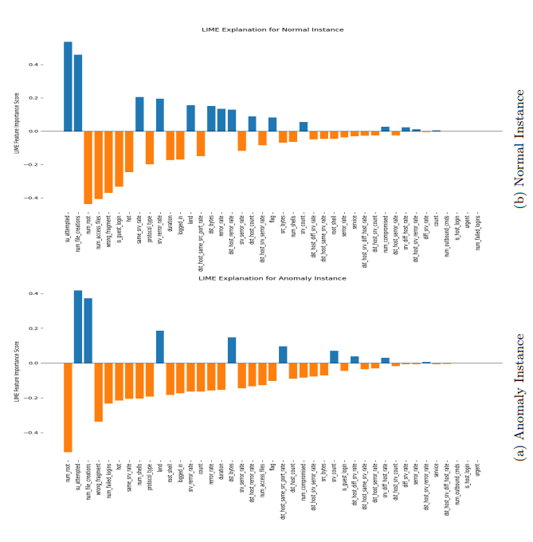
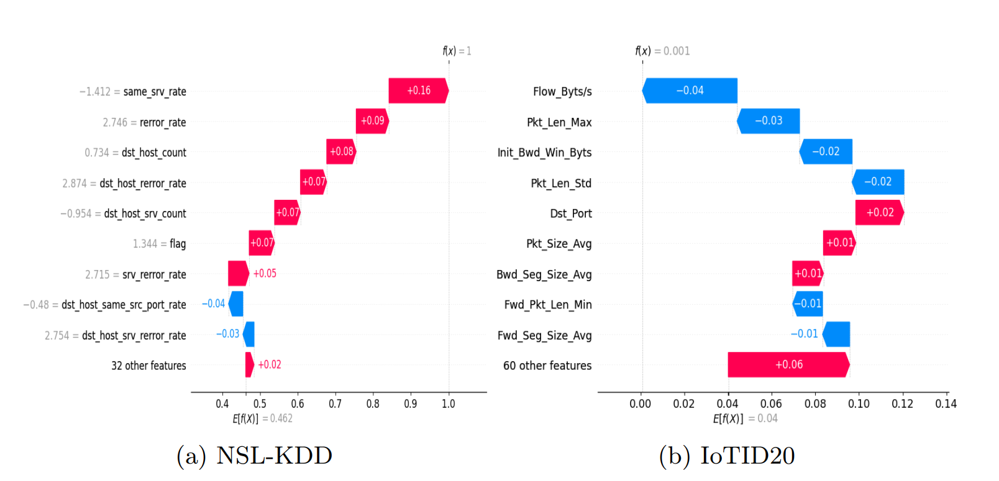
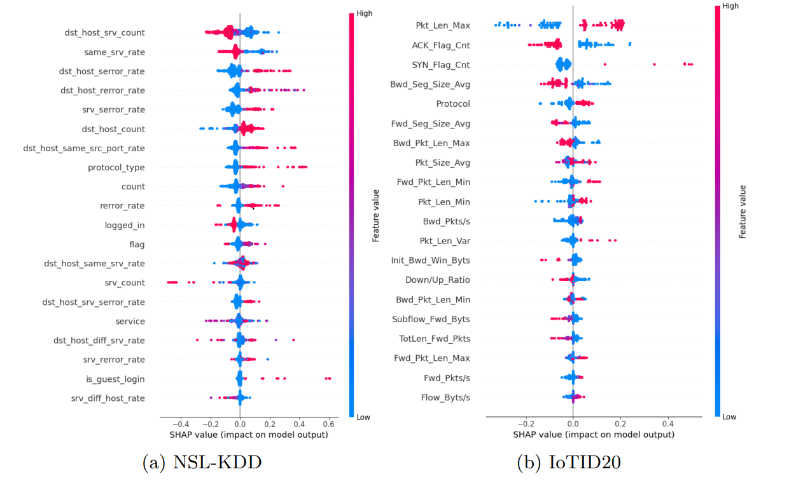
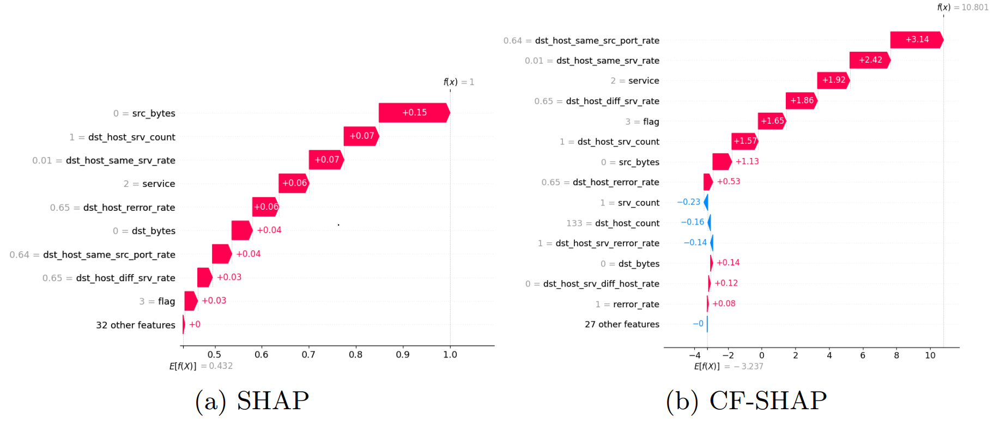
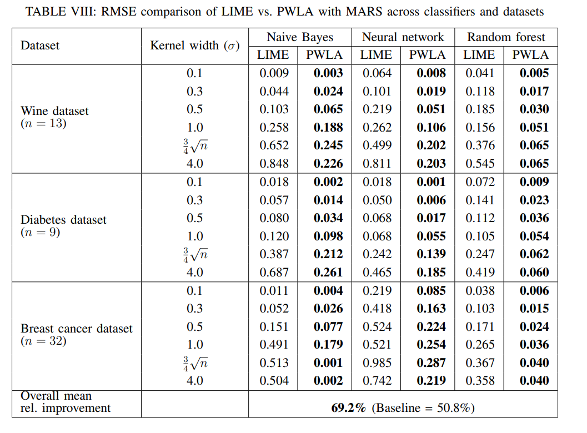

# Enhancing Intrusion Detection Systems Interpretability Using XAI

Abstract. This paper addresses the critical challenge of improving the
interpretability and explainability of Intrusion Detection Systems (IDS),
which play a vital role in identifying and mitigating network attacks.
Modern IDS models often operate as "black boxes," making their predictions difficult for security teams to comprehend and trust. This lack of
transparency hinders effective decision-making and limits the widespread
adoption of machine learning-based IDS in critical sectors. To address
this issue, the study evaluates the predictive performance of IDS models through various explainable AI (XAI) techniques, including LIME,
LEMNA, and SHAP. These techniques offer both local and global expla-
nations, allowing security professionals to understand the key features
driving model predictions and derive actionable insights for mitigating
potential threats. The paper also explores counterfactual analysis us-
ing CF-SHAP to enhance interpretability by identifying alternative solu-
tions. Experimental evaluations on the NSL-KDD and IoTID20 datasets
demonstrate that these XAI techniques generate meaningful explana-
tions of the model’s predictions. Specifically, SHAP, LIME, and LEMNA
effectively highlight important features influencing LSTM model predic-
tions, while CF-SHAP provides actionable counterfactual explanations
when applied to models trained with XGBoost. The results highlight the
potential of XAI techniques to bridge the gap between model accuracy
and interpretability, fostering improved trust and practical usability of
IDS in real-world cybersecurity applications.

# IDS Model Explainability
Local Explanation: LIME-based explanation of anomaly and normal instance from NSL-KDD.

Instance-level SHAP explanations for anomaly instances

Global Explanation: SHAP summary plot displaying global feature importance. The plot ranks features by their impact across multiple classifications, with colors indicating the range of feature values
contributing to each prediction

Explanation for an anomaly traffic instance (portsweep attack) given by
(a) SHAP and (b) CF-SHAP

# Contact

If you have any questions, please contact ss472s@MissouriState.edu or hellosanjeev4@gmail.com.

